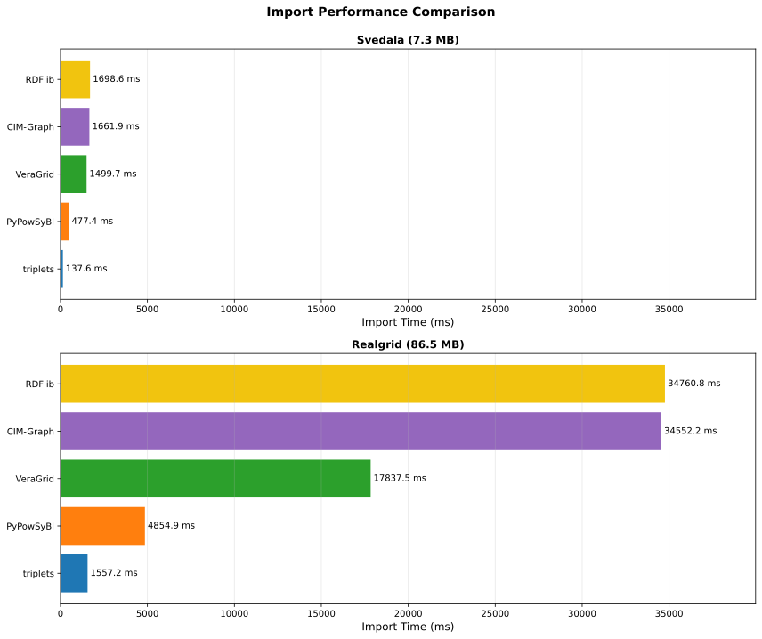
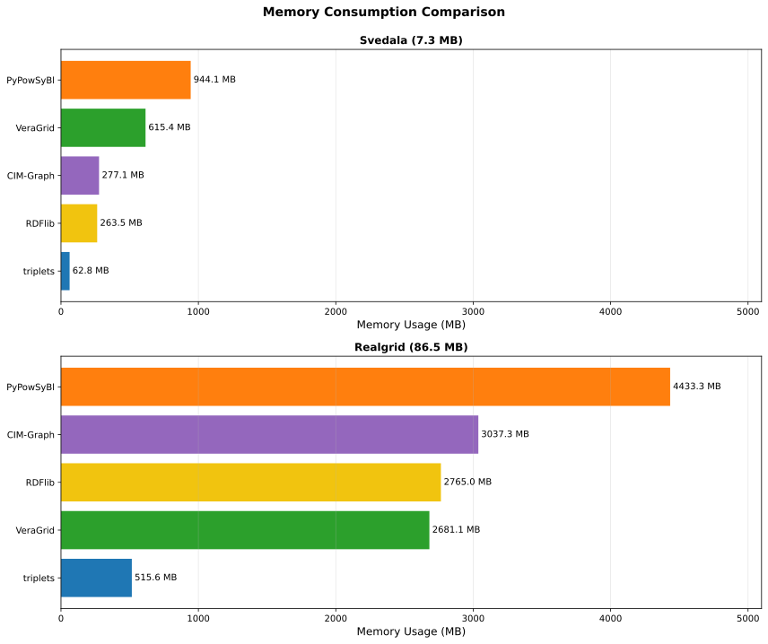

# cim-bench

Performance benchmarking suite for CIM (Common Information Model) parsers and serializers.

## Benchmark Results

Latest results on AMD Ryzen AI 9 HX 370, 64GB RAM, Python 3.13.12:

### Comparison Summary

**Small Dataset (Svedala - 7.3 MB):**

| Library | Version | Load Time | Memory | Query Speed | Elements |
|---------|---------|-----------|--------|-------------|----------|
| **triplets** | 0.0.17 | 147 ms | 45.5 MB | 2-7 ms | 97 lines, 39 gen, 73 loads, 56 subs |
| **pypowsybl** | 1.14.0 | 558 ms | 921 MB | 185-432 μs | 97 lines, 39 gen, 73 loads, 56 subs |
| **VeraGrid** | 5.6.26 | 1.64 s | 630 MB | 39-59 ns | 97 lines, 39 gen, 73 loads, 56 subs |

**Large Dataset (RealGrid - 86.5 MB):**

| Library | Version | Load Time | Memory | Query Speed | Elements |
|---------|---------|-----------|--------|-------------|----------|
| **triplets** | 0.0.17 | 1.62 s | 465 MB | 14-44 ms | 7561 lines, 1347 gen, 6687 loads, 4875 subs |
| **pypowsybl** | 1.14.0 | 4.97 s | 3931 MB | 7-55 ms | 7561 lines, 1347 gen, 6687 loads, 4791 subs |
| **VeraGrid** | 5.6.26 | 18.0 s | 2689 MB | 45-125 ns | 7561 lines, 1347 gen, 6687 loads, 4875 subs |


### Import Performance Comparison


<!--  -->

*Cross-dataset comparison showing how all three parsers scale from small (7.3 MB) to large (86.5 MB) datasets*

### Detailed Results: Svedala IGM Dataset (7.3 MB, CGMES 3.0)

#### triplets - RDF/Pandas Parser
- **Load Time**: 147 ms
- **Memory**: 45.5 MB
- **Data Structure**: ~95,000 triplets, ~14,500 unique objects
- **Network Elements**: 97 lines, 39 generators, 73 loads, 56 substations
- **Query Performance**: 2-7 ms (DataFrame queries for CIM types)
- **Strengths**: Fast loading, minimal memory, simple API, pandas integration
- **Use Case**: Data extraction, batch processing, RDF manipulation, quick analysis

#### pypowsybl - Power System Network Model
- **Load Time**: 558 ms
- **Memory**: 921 MB
- **Network Elements**: 97 lines, 39 generators, 73 loads, 56 substations
- **Query Performance**: 185-432 μs (DataFrame access to network model)
- **Strengths**: Rich network model, sub-millisecond queries, analysis-ready
- **Use Case**: Power flow analysis, network operations, TSO applications, CGMES validation

#### VeraGrid - CGMES Circuit Model
- **Load Time**: 1.64 s (11.2x slower than triplets, 2.9x slower than pypowsybl)
- **Memory**: 630 MB (13.8x more than triplets, 0.68x pypowsybl)
- **Network Elements**: 97 lines, 39 generators, 73 loads, 56 substations
- **Query Performance**: 39-59 ns (O(1) list access to CGMES assets)
- **Strengths**: Fastest queries (sub-microsecond), direct CGMES object access, full circuit model
- **Use Case**: CGMES analysis, rapid queries on loaded data, GridCal power systems analysis

### Detailed Results: RealGrid Dataset (86.5 MB, CGMES 2.4.15)

#### triplets - RDF/Pandas Parser
- **Load Time**: 1.62 s
- **Memory**: 465 MB
- **Network Elements**: 7561 lines, 1347 generators, 6687 loads (EnergyConsumer), 4875 substations
- **Query Performance**: 14-44 ms (DataFrame queries scale with data size)
- **Strengths**: Linear scaling, handles large datasets efficiently
- **Use Case**: Large-scale data processing, European grid analysis

#### pypowsybl - Power System Network Model
- **Load Time**: 4.97 s
- **Memory**: 3931 MB
- **Network Elements**: 7561 lines, 1347 generators, 6687 loads, 4791 substations
- **Query Performance**: 7-55 ms (DataFrame access to network model)
- **Strengths**: Fast queries even on large datasets, comprehensive network model
- **Use Case**: Pan-European grid analysis, large TSO networks, production systems

#### VeraGrid - CGMES Circuit Model
- **Load Time**: 18.0 s (11.1x slower than triplets, 3.6x slower than pypowsybl)
- **Memory**: 2689 MB (5.8x more than triplets, 0.68x pypowsybl)
- **Network Elements**: 7561 lines, 1347 generators, 6687 loads, 4875 substations
- **Query Performance**: 45-125 ns (O(1) list access to CGMES assets)
- **Strengths**: Sub-microsecond queries, direct CGMES object access, scales well for queries
- **Use Case**: Large-scale CGMES analysis, query-intensive workflows, GridCal integration


See `tools/*/README.md` for detailed per-tool documentation and analysis.

## Planned Test Additions

## Parsers/Serializers

| Status | Tool / Library | Language | Main Purpose / Strength | Triplet / Graph Access? | CGMES / CIM Support | GitHub / Source | Notes |
|--------|----------------|----------|-------------------------|------------------------|---------------------|-----------------|-------|
| ✅ | **triplets** | Python | Pandas-based RDF parser | Yes (DataFrame triplets) | Version-agnostic CIM/CGMES | [triplets](https://github.com/Haigutus/triplets) | Fast loading, low memory, simple API |
| ✅ | **pypowsybl** | Python | PowSyBl wrapper (network import/export) | Indirect (via network objects) | CGMES 2.4.15/3.0 CGMES import/export | [powsybl/pypowsybl](https://github.com/powsybl/pypowsybl) | Grid-analysis oriented; rich network model |
| ✅ | **GridCal/VeraGrid** | Python | Power systems analysis with UI | Indirect (CGMES circuit model) | CGMES 2.4.15/3.0 import | [SanPen/GridCal](https://github.com/SanPen/GridCal) | Sub-microsecond queries, full circuit model |
| ✅ | **RDFlib** | Python | Generic RDF parser/triple store | Excellent (native triples) | None (generic) | [RDFLib/rdflib](https://github.com/RDFLib/rdflib) | Baseline for speed/memory comparison with Oxigraph |
| ✅ | **CIMantic Graphs** | Python | In-memory labeled property graph | Yes (strong, knowledge graph API) | CIM15–18, custom profiles | [PNNL-CIM-Tools/CIM-Graph](https://github.com/PNNL-CIM-Tools/CIM-Graph) | Modern API, uses RDFlib with typed CIM objects |
| 📋 | **cimpy** | Python | Import/export/modify CGMES XML/RDF | Yes (via RDFlib backend) | CGMES / IEC61970 focused | [sogno-platform/cimpy](https://github.com/sogno-platform/cimpy) | Battle-tested in European projects |
| 📋 | **libcimpp** | C++ | Fast serialize/deserialize CIM XML/RDF | Partial (object model) | CGMES / IEC61970/61968/62325 | [sogno-platform/libcimpp](https://github.com/sogno-platform/libcimpp) | Likely fastest/lowest memory |
| 📋 | **pycgmes** | Python | Dataclasses + RDF schema + SHACL | Yes (dataclass mapping) | CGMES 3.0+ | [alliander-opensource/pycgmes](https://github.com/alliander-opensource/pycgmes) | Strong SHACL validation |
| 📋 | **OpenCGMES** | Java | Suite for CGMES / CIM RDF parser | Yes (CIMXML parser) | CGMES / IEC61970-552 | [SOPTIM/OpenCGMES](https://github.com/SOPTIM/OpenCGMES) | Recent CIMXML-specific fixes |
| 📋 | **Apache Jena** | Java | RDF framework + CIMXML parser | Excellent | Potential via custom parser | [apache/jena](https://github.com/apache/jena) | Generic + 2025 CIMXML branch |
| 📋 | **CIMverter** | Java/C++ | Convert CIM RDF to Modelica | Partial | CGMES compatible | [cim-iec/cimverter](https://github.com/cim-iec/cimverter) | Round-trip fidelity testing |
| 📋 | **CIMDraw** | Web/JS | View/edit CGMES node-breaker models | Indirect | ENTSO-E CGMES profile | [danielePala/CIMDraw](https://github.com/danielePala/CIMDraw) | Visual completeness check |
| 📋 | **GraphDB** | Java | Graph database with RDF support | Excellent | Generic RDF | [Ontotext GraphDB](https://www.ontotext.com/products/graphdb/) | Enterprise SPARQL database |
| 📋 | **CIMbion** | TBD | CIM/CGMES data management | TBD | CGMES | [Veracity Store](https://store.veracity.com/cimbion) | Closed source, commercial |
| 📋 | **CIMdesk** | Various | CIM data management | TBD | CGMES | TBD | To be investigated |

**Legend:**
- ✅ Benchmarked
- 📋 Planned

### 📊 Additional Benchmarks

| Test Category | Description | Metrics | Why Important |
|---------------|-------------|---------|---------------|
| **Export/Serialization** | Write loaded CIM data back to RDF/XML | Time, file size, memory | Round-trip capability, data export use cases |
| **Round-trip Fidelity** | Load → Export → Load → Diff check | Time, diff count, data loss % | Data integrity, lossless conversion verification |
| **SHACL Validation** | Validate CIM models against SHACL shapes | Time, violations found, memory | Data quality, CGMES compliance checking |
| **SPARQL Queries** | Complex graph queries on loaded data | Query time, result count | Advanced data extraction, relationship queries |


### 📁 Planned Datasets

| Dataset | Size | CGMES Version | Network Type | Elements | Status | Purpose |
|---------|------|---------------|--------------|----------|--------|---------|
| **Svedala IGM** | 7.3 MB | CGMES 3.0 | Small (Sweden) | 97 lines, 39 gen, 73 loads, 56 subs | ✅ Active | Fast iteration, baseline tests |
| **RealGrid** | 86.5 MB (3.7 MB compressed) | CGMES 2.4.15 | Large (Pan-European) | 10,000+ elements | ✅ Active | Scalability, real-world TSO scenarios |
| **NC Profiles** | ~50-100 MB | CGMES 3.0 | Medium (ENTSO-E) | TBD | 📋 Planned | Network Code validation, cross-border |

**Comparison Targets**:
- **Small (Svedala)**: Fast parsing, edge case testing, CI/CD friendly
- **Large (RealGrid)**: Memory stress, scalability limits, production-scale performance

### 📈 Performance Visualizations

Performance graphs are automatically generated when running `./run_benchmarks.sh` (requires matplotlib).

**Visualization Types:**

#### Per-Dataset Comparisons
Graphs grouped by **dataset** showing tool comparisons side-by-side:

**Svedala Dataset (7.3 MB)**
- **Comparison**: Load time, memory, and average query performance for all three parsers
  - `results/graphs/svedala_comparison.svg`
- **Detailed**: Load time, memory, lines parsed, generators parsed
  - `results/graphs/svedala_detailed.svg`

**RealGrid Dataset (86.5 MB)**
- **Comparison**: Load time, memory, and average query performance for all three parsers
  - `results/graphs/realgrid_comparison.svg`
- **Detailed**: Load time, memory, lines parsed, generators parsed
  - `results/graphs/realgrid_detailed.svg`

#### Cross-Dataset Comparisons
Graphs showing all three parsers across both datasets for each metric:

- **Import Comparison**: Load/import time for all parsers on both datasets
  - `results/graphs/import_comparison.svg`
- **Memory Comparison**: Memory usage for all parsers on both datasets
  - `results/graphs/memory_comparison.svg`
- **Query Comparison**: Average query performance for all parsers on both datasets
  - `results/graphs/query_comparison.svg`

**Graph Layout**:
- Separate horizontal subplots per dataset (Svedala top, RealGrid bottom)
- Within each dataset, parsers sorted from fastest/smallest to slowest/largest
- Consistent x-axis scales across subplots for easy absolute comparison (log scale for query performance)
- Color palette: triplets (blue), pypowsybl (orange), VeraGrid (green), RDFlib (yellow), CIM-Graph (purple)

**Metrics visualized**:
- Import/load time (ms)
- Memory usage (MB)
- Query performance (ms, log scale)
- Network elements parsed (lines, generators, loads, substations)

*All graphs are generated in SVG format for scalability and web compatibility. Query performance graphs use logarithmic scale to show differences between fast parsers while keeping slower ones visible.*

### 🔧 Planned Infrastructure Changes

**Goal**: Isolated, reproducible benchmark environment per parser

#### Docker-based Testing
- **One container per parser/tool** with all dependencies pre-installed
- **Standardized test interface**: Same input datasets, same output format
- **Resource limits**: CPU/memory constraints for fair comparison
- **Version pinning**: Lock parser versions for reproducible results

#### Benefits
- ✅ No dependency conflicts between parsers
- ✅ Easy CI/CD integration
- ✅ Reproducible across different machines
- ✅ Clean test environment per run
- ✅ Support for Java/C++/Python/JS parsers without local installs

#### Structure
```
benchmarks/
├── docker/
│   ├── triplets/
│   │   ├── Dockerfile
│   │   └── requirements.txt
│   ├── pypowsybl/
│   │   ├── Dockerfile
│   │   └── requirements.txt
│   ├── cimpy/
│   ├── libcimpp/
│   └── ...
├── run_all_benchmarks.sh
└── collect_results.py
```

#### Execution Flow
```bash
# Run all benchmarks in containers
./benchmarks/run_all_benchmarks.sh

# Results collected to results/ with standardized JSON format
# Auto-generate comparison reports
```

## Getting Started

### Prerequisites

This repository uses **Git LFS** (Large File Storage) for large dataset files. Install it before cloning:

```bash
# Ubuntu/Debian
sudo apt-get install git-lfs

# macOS
brew install git-lfs

# After installation
git lfs install
```

For other systems, see: https://git-lfs.github.com/

### Quick Setup

**Automated setup (recommended):**
```bash
# Clone the repository
git clone https://github.com/yourusername/cim-bench.git
cd cim-bench

# Run setup script (installs uv, Git LFS, pulls submodules and LFS files, installs dependencies)
./setup.sh
```

**Manual setup:**
```bash
# Install Git LFS
git lfs install

# Clone with submodules
git clone --recurse-submodules https://github.com/yourusername/cim-bench.git
cd cim-bench

# Pull LFS files (parent repo and all submodules)
git lfs pull
git submodule foreach --recursive git lfs pull

# Install dependencies
uv sync

# Optional: Install visualization dependencies
uv sync --extra visualization
```

### Running Benchmarks

**Quick Start - Run all benchmarks and generate reports:**
```bash
./run_benchmarks.sh
```

**Fast iteration mode (fewer rounds):**
```bash
./run_benchmarks.sh --quick
```

**Skip benchmarks with existing results:**
```bash
./run_benchmarks.sh --skip-existing
```

**Combine flags:**
```bash
./run_benchmarks.sh --quick --skip-existing
```

This will:
1. Run all configured benchmarks (or skip those with existing JSON results if `--skip-existing` is used)
2. Save JSON results to `results/`
3. Generate individual markdown reports
4. Create a comparison summary report
5. Generate performance visualization graphs (if matplotlib is installed)

**Manual benchmark execution:**

Run all benchmarks:
```bash
uv run pytest benchmarks/ --benchmark-only
```

Run specific benchmark:
```bash
uv run pytest benchmarks/triplets_svedala_benchmark.py --benchmark-only
```

Save results to JSON:
```bash
uv run pytest benchmarks/ --benchmark-only --benchmark-json=results/output.json
```

Generate markdown report from results:
```bash
uv run python tools/generate_report.py results/output.json results/output_report.md
```

Generate comparison report:
```bash
uv run python tools/generate_comparison.py results/file1.json results/file2.json results/comparison.md
```

Generate performance visualization graphs:
```bash
uv run python tools/generate_graphs.py
```

This creates SVG graphs in `results/graphs/`:

**Per-dataset comparisons** (tools compared within each dataset):
- `svedala_comparison.svg` - Svedala: load time, memory, and query performance
- `svedala_detailed.svg` - Svedala: detailed metrics with network elements
- `realgrid_comparison.svg` - RealGrid: load time, memory, and query performance
- `realgrid_detailed.svg` - RealGrid: detailed metrics with network elements

**Cross-dataset comparisons** (all three parsers across both datasets):
- `import_comparison.svg` - Import/load time comparison
- `memory_comparison.svg` - Memory usage comparison
- `query_comparison.svg` - Query performance comparison

**Adding new benchmarks:**

The benchmark runner automatically discovers all `*_benchmark.py` files in the `benchmarks/` directory. Simply create a new benchmark file following the adapter pattern (see `CLAUDE.md` for details) and it will be included in the next run.

## Contributing

Add new benchmark cases in the `benchmarks/` directory following the existing patterns.
